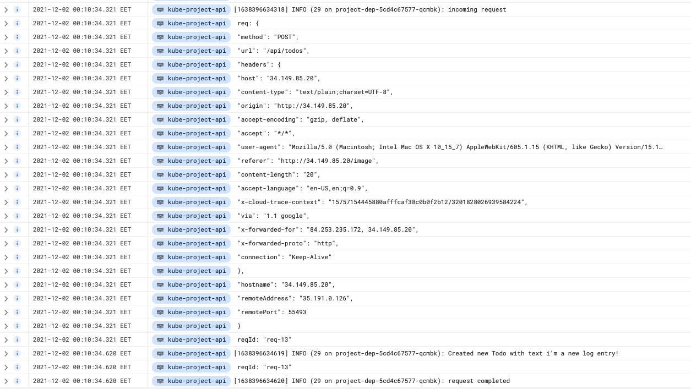
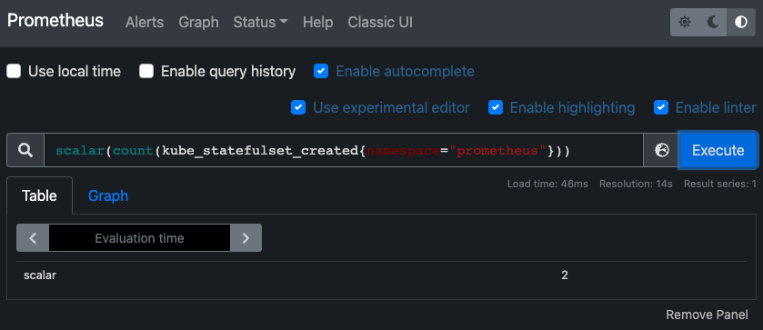
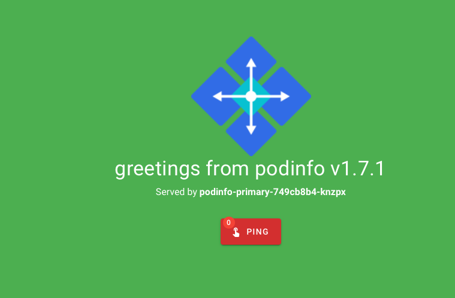

# Project

This is a fullstack project that consists of a Node fastify backend and NextJS frontend.

Available routes:

1. `/`: create-next-app default page
1. `/image`: Random image of the day, a list of existing todos and a form to add a new one
1. `/api`: Static hello-world html served from the backend
1. `/api/todos`: GET endpoint returning JSON of todos
1. `/api/randomImage`: Image of the day returned from the backend

## Exercise 3.06: DBaaS vs DIY

### DBaaS:

Pros:

- quick and easy to get started
- vendor support
- easier maintenance
- automatic scaling and replication, backups

Cons:

- can get pricey real quick
- vendor lock-in

### DIY

Pros:

- is DIY
- probably cheaper
- complete control

Cons:

- takes more time to get started, do maintenance
- requires a lot more know-how
- no one else to blame if something goes wrong
- no automatic backups or scaling

## Exercise 3.07: Commitment

I chose DIY because it's cooler and I already have it implemented. Doing everything yourself also means you get to make all the possible mistakes and maybe even learn from them.


## Exercise 3.10: Project v1.6



## Exercise 4.03: Prometheus



## Exercise 4.06: Project 2.0

As can be seen from the video below, there are 6 replicas of the broadcaster app running at the same time and they do not interfere with each other.

https://user-images.githubusercontent.com/42574232/144722192-6e638dfe-8dd1-4602-b573-95b1a0ea211b.mov

## Exercise 4.07: GitOpsify Cluster

Cluster config is stored at https://github.com/yusifsalam/kube-cluster-dwk

Ping-pong app requires a secret for the postgres password, so a secret has to be created in the flux-system namespace. Assuming the age key file is `key.txt`, the command is:
`cat key.txt | kubectl -n flux-system create secret generic sops-age \ --from-file=age.agekey=/dev/stdin`. The key has to end with "agekey" for flux to know that it's an age key file and be able to decrypt it.
After creating the sops-age secret, we can run `flux reconcile kustomization my-secrets` to force a sync instead of waiting for 10m.

## Exercise 5.03: Learn from external material



<details> 
<summary>Code output</summary>

```
kubernetes on  master [?⇡] on ☁️
❯ kubectl apply -k github.com/fluxcd/flagger/kustomize/linkerd
customresourcedefinition.apiextensions.k8s.io/alertproviders.flagger.app created
customresourcedefinition.apiextensions.k8s.io/canaries.flagger.app created
customresourcedefinition.apiextensions.k8s.io/metrictemplates.flagger.app created
serviceaccount/flagger created
clusterrole.rbac.authorization.k8s.io/flagger created
clusterrolebinding.rbac.authorization.k8s.io/flagger created
deployment.apps/flagger created

kubernetes on  master [?⇡] on ☁️ took 2s
❯ kubectl -n linkerd rollout status deploy/flagger
deployment "flagger" successfully rolled out

kubernetes on  master [?⇡] on ☁️
❯ kubectl create ns test && \
 kubectl apply -f https://run.linkerd.io/flagger.yml
namespace/test created
deployment.apps/load created
configmap/frontend created
deployment.apps/frontend created
service/frontend created
deployment.apps/podinfo created
service/podinfo created

kubernetes on  master [?⇡] on ☁️
❯ kubectl -n test rollout status deploy podinfo
Waiting for deployment "podinfo" rollout to finish: 0 of 1 updated replicas are available...
deployment "podinfo" successfully rolled out

kubernetes on  master [?⇡] on ☁️ took 7s
❯ kubectl -n test port-forward svc/frontend 8080
Forwarding from 127.0.0.1:8080 -> 8080
Forwarding from [::1]:8080 -> 8080
Handling connection for 8080
^C⏎

kubernetes on  master [?⇡] on ☁️ took 30s
❯ zsh

kubernetes on  master [?⇡] on ☁️
❯ >....
apiVersion: apps/v1
kind: Deployment
name: podinfo
service:
port: 9898
analysis:
interval: 10s
threshold: 5
stepWeight: 10
maxWeight: 100
metrics: - name: request-success-rate
thresholdRange:
min: 99
interval: 1m - name: request-duration
thresholdRange:
max: 500
interval: 1m
EOF
canary.flagger.app/podinfo created

kubernetes on  master [?⇡] on ☁️ took 2s
❯

kubernetes on  master [?⇡] on ☁️ took 10s
❯ kubectl -n test get ev --watch
LAST SEEN TYPE REASON OBJECT MESSAGE
91s Normal ScalingReplicaSet deployment/load Scaled up replica set load-7f97579865 to 1
91s Normal ScalingReplicaSet deployment/frontend Scaled up replica set frontend-6957977dc7 to 1
91s Normal Injected deployment/load Linkerd sidecar proxy injected
91s Normal Injected deployment/frontend Linkerd sidecar proxy injected
91s Normal SuccessfulCreate replicaset/load-7f97579865 Created pod: load-7f97579865-hjxbr
90s Normal Scheduled pod/load-7f97579865-hjxbr Successfully assigned test/load-7f97579865-hjxbr to k3d-k3s-default-agent-2
91s Normal ScalingReplicaSet deployment/podinfo Scaled up replica set podinfo-7bfd46f477 to 1
91s Normal SuccessfulCreate replicaset/frontend-6957977dc7 Created pod: frontend-6957977dc7-h5j2b
91s Normal Injected deployment/podinfo Linkerd sidecar proxy injected
90s Normal Scheduled pod/frontend-6957977dc7-h5j2b Successfully assigned test/frontend-6957977dc7-h5j2b to k3d-k3s-default-agent-1
91s Normal SuccessfulCreate replicaset/podinfo-7bfd46f477 Created pod: podinfo-7bfd46f477-znn9v
90s Normal Scheduled pod/podinfo-7bfd46f477-znn9v Successfully assigned test/podinfo-7bfd46f477-znn9v to k3d-k3s-default-agent-0
90s Normal Pulled pod/frontend-6957977dc7-h5j2b Container image "cr.l5d.io/linkerd/proxy-init:v1.4.0" already present on machine
90s Normal Created pod/frontend-6957977dc7-h5j2b Created container linkerd-init
90s Normal Started pod/frontend-6957977dc7-h5j2b Started container linkerd-init
90s Warning FailedMount pod/load-7f97579865-hjxbr MountVolume.SetUp failed for volume "kube-api-access-vzc76" : failed to sync configmap cache: timed out waiting for the condition
90s Warning FailedMount pod/podinfo-7bfd46f477-znn9v MountVolume.SetUp failed for volume "kube-api-access-m8894" : failed to sync configmap cache: timed out waiting for the condition
89s Normal Pulled pod/load-7f97579865-hjxbr Container image "cr.l5d.io/linkerd/proxy-init:v1.4.0" already present on machine
89s Normal Pulled pod/frontend-6957977dc7-h5j2b Container image "cr.l5d.io/linkerd/proxy:stable-2.11.1" already present on machine
88s Normal Pulled pod/podinfo-7bfd46f477-znn9v Container image "cr.l5d.io/linkerd/proxy-init:v1.4.0" already present on machine
88s Normal Created pod/load-7f97579865-hjxbr Created container linkerd-init
88s Normal Created pod/frontend-6957977dc7-h5j2b Created container linkerd-proxy
88s Normal Started pod/frontend-6957977dc7-h5j2b Started container linkerd-proxy
88s Normal IssuedLeafCertificate serviceaccount/default issued certificate for default.test.serviceaccount.identity.linkerd.cluster.local until 2021-12-13 13:28:51 +0000 UTC: 0c284596d2ba0c9bd487194a6f4e7241
88s Normal Pulling pod/frontend-6957977dc7-h5j2b Pulling image "nginx:alpine"
88s Normal Started pod/load-7f97579865-hjxbr Started container linkerd-init
87s Normal Created pod/podinfo-7bfd46f477-znn9v Created container linkerd-init
87s Normal Started pod/podinfo-7bfd46f477-znn9v Started container linkerd-init
87s Normal Pulled pod/podinfo-7bfd46f477-znn9v Container image "cr.l5d.io/linkerd/proxy:stable-2.11.1" already present on machine
87s Normal Pulled pod/load-7f97579865-hjxbr Container image "cr.l5d.io/linkerd/proxy:stable-2.11.1" already present on machine
86s Normal Created pod/podinfo-7bfd46f477-znn9v Created container linkerd-proxy
86s Normal Started pod/podinfo-7bfd46f477-znn9v Started container linkerd-proxy
86s Normal IssuedLeafCertificate serviceaccount/default issued certificate for default.test.serviceaccount.identity.linkerd.cluster.local until 2021-12-13 13:28:53 +0000 UTC: 5990fc0bd67b9a81a176a40a70fce76d
86s Normal Created pod/load-7f97579865-hjxbr Created container linkerd-proxy
86s Normal Pulling pod/podinfo-7bfd46f477-znn9v Pulling image "quay.io/stefanprodan/podinfo:1.7.0"
86s Normal Started pod/load-7f97579865-hjxbr Started container linkerd-proxy
86s Normal IssuedLeafCertificate serviceaccount/default issued certificate for default.test.serviceaccount.identity.linkerd.cluster.local until 2021-12-13 13:28:53 +0000 UTC: f6f8f629256f61c02013ae67a2303a9e
85s Normal Pulling pod/load-7f97579865-hjxbr Pulling image "buoyantio/slow_cooker:1.2.0"
78s Normal Pulled pod/frontend-6957977dc7-h5j2b Successfully pulled image "nginx:alpine" in 9.901443629s
77s Normal Pulled pod/podinfo-7bfd46f477-znn9v Successfully pulled image "quay.io/stefanprodan/podinfo:1.7.0" in 8.653179129s
77s Normal Created pod/frontend-6957977dc7-h5j2b Created container nginx
77s Normal Started pod/frontend-6957977dc7-h5j2b Started container nginx
77s Normal Pulled pod/load-7f97579865-hjxbr Successfully pulled image "buoyantio/slow_cooker:1.2.0" in 7.944026169s
76s Normal Created pod/podinfo-7bfd46f477-znn9v Created container podinfod
76s Normal Started pod/podinfo-7bfd46f477-znn9v Started container podinfod
76s Normal Created pod/load-7f97579865-hjxbr Created container slow-cooker
76s Normal Started pod/load-7f97579865-hjxbr Started container slow-cooker
10s Normal Synced canary/podinfo all the metrics providers are available!
10s Normal ScalingReplicaSet deployment/podinfo-primary Scaled up replica set podinfo-primary-8597944c55 to 1
10s Warning Synced canary/podinfo podinfo-primary.test not ready: waiting for rollout to finish: observed deployment generation less than desired generation
10s Normal Injected deployment/podinfo-primary Linkerd sidecar proxy injected
10s Normal SuccessfulCreate replicaset/podinfo-primary-8597944c55 Created pod: podinfo-primary-8597944c55-7wwtz
9s Normal Scheduled pod/podinfo-primary-8597944c55-7wwtz Successfully assigned test/podinfo-primary-8597944c55-7wwtz to k3d-k3s-default-server-0
9s Normal Pulled pod/podinfo-primary-8597944c55-7wwtz Container image "cr.l5d.io/linkerd/proxy-init:v1.4.0" already present on machine
9s Normal Created pod/podinfo-primary-8597944c55-7wwtz Created container linkerd-init
8s Normal Started pod/podinfo-primary-8597944c55-7wwtz Started container linkerd-init
8s Normal Pulled pod/podinfo-primary-8597944c55-7wwtz Container image "cr.l5d.io/linkerd/proxy:stable-2.11.1" already present on machine
8s Normal Created pod/podinfo-primary-8597944c55-7wwtz Created container linkerd-proxy
8s Normal Started pod/podinfo-primary-8597944c55-7wwtz Started container linkerd-proxy
8s Normal IssuedLeafCertificate serviceaccount/default issued certificate for default.test.serviceaccount.identity.linkerd.cluster.local until 2021-12-13 13:30:11 +0000 UTC: 5d3ff122b00ade3a9ce562216c867502
7s Normal Pulling pod/podinfo-primary-8597944c55-7wwtz Pulling image "quay.io/stefanprodan/podinfo:1.7.0"
1s Normal Pulled pod/podinfo-primary-8597944c55-7wwtz Successfully pulled image "quay.io/stefanprodan/podinfo:1.7.0" in 5.311309419s
1s Normal Created pod/podinfo-primary-8597944c55-7wwtz Created container podinfod
1s Normal Started pod/podinfo-primary-8597944c55-7wwtz Started container podinfod
0s Normal Synced canary/podinfo all the metrics providers are available!
0s Normal ScalingReplicaSet deployment/podinfo Scaled down replica set podinfo-7bfd46f477 to 0
0s Normal Killing pod/podinfo-7bfd46f477-znn9v Stopping container linkerd-proxy
0s Normal SuccessfulDelete replicaset/podinfo-7bfd46f477 Deleted pod: podinfo-7bfd46f477-znn9v
0s Normal Killing pod/podinfo-7bfd46f477-znn9v Stopping container podinfod
0s Warning FailedToUpdateEndpoint endpoints/podinfo Failed to update endpoint test/podinfo: Operation cannot be fulfilled on endpoints "podinfo": the object has been modified; please apply your changes to the latest version and try again
0s Normal Synced canary/podinfo Initialization done! podinfo.test
^C⏎

kubernetes on  master [?⇡] on ☁️ took 50s
❯ kubectl -n test get svc
NAME TYPE CLUSTER-IP EXTERNAL-IP PORT(S) AGE
frontend ClusterIP 10.43.209.250 <none> 8080/TCP 2m29s
podinfo-canary ClusterIP 10.43.135.123 <none> 9898/TCP 68s
podinfo-primary ClusterIP 10.43.0.79 <none> 9898/TCP 68s
podinfo ClusterIP 10.43.112.138 <none> 9898/TCP 2m29s

kubernetes on  master [?⇡] on ☁️
❯ kubectl -n test set image deployment/podinfo \
 podinfod=quay.io/stefanprodan/podinfo:1.7.1
deployment.apps/podinfo image updated

kubernetes on  master [?⇡] on ☁️
❯ kubectl -n test get ev --watch
LAST SEEN TYPE REASON OBJECT MESSAGE
2m52s Normal ScalingReplicaSet deployment/load Scaled up replica set load-7f97579865 to 1
2m52s Normal ScalingReplicaSet deployment/frontend Scaled up replica set frontend-6957977dc7 to 1
2m52s Normal Injected deployment/load Linkerd sidecar proxy injected
2m52s Normal Injected deployment/frontend Linkerd sidecar proxy injected
2m52s Normal SuccessfulCreate replicaset/load-7f97579865 Created pod: load-7f97579865-hjxbr
2m51s Normal Scheduled pod/load-7f97579865-hjxbr Successfully assigned test/load-7f97579865-hjxbr to k3d-k3s-default-agent-2
2m52s Normal ScalingReplicaSet deployment/podinfo Scaled up replica set podinfo-7bfd46f477 to 1
2m52s Normal SuccessfulCreate replicaset/frontend-6957977dc7 Created pod: frontend-6957977dc7-h5j2b
2m51s Normal Scheduled pod/frontend-6957977dc7-h5j2b Successfully assigned test/frontend-6957977dc7-h5j2b to k3d-k3s-default-agent-1
2m52s Normal SuccessfulCreate replicaset/podinfo-7bfd46f477 Created pod: podinfo-7bfd46f477-znn9v
2m51s Normal Scheduled pod/podinfo-7bfd46f477-znn9v Successfully assigned test/podinfo-7bfd46f477-znn9v to k3d-k3s-default-agent-0
2m51s Normal Pulled pod/frontend-6957977dc7-h5j2b Container image "cr.l5d.io/linkerd/proxy-init:v1.4.0" already present on machine
2m51s Normal Created pod/frontend-6957977dc7-h5j2b Created container linkerd-init
2m51s Normal Started pod/frontend-6957977dc7-h5j2b Started container linkerd-init
2m51s Warning FailedMount pod/load-7f97579865-hjxbr MountVolume.SetUp failed for volume "kube-api-access-vzc76" : failed to sync configmap cache: timed out waiting for the condition
2m51s Warning FailedMount pod/podinfo-7bfd46f477-znn9v MountVolume.SetUp failed for volume "kube-api-access-m8894" : failed to sync configmap cache: timed out waiting for the condition
2m50s Normal Pulled pod/load-7f97579865-hjxbr Container image "cr.l5d.io/linkerd/proxy-init:v1.4.0" already present on machine
2m50s Normal Pulled pod/frontend-6957977dc7-h5j2b Container image "cr.l5d.io/linkerd/proxy:stable-2.11.1" already present on machine
2m49s Normal Pulled pod/podinfo-7bfd46f477-znn9v Container image "cr.l5d.io/linkerd/proxy-init:v1.4.0" already present on machine
2m49s Normal Created pod/load-7f97579865-hjxbr Created container linkerd-init
2m49s Normal Created pod/frontend-6957977dc7-h5j2b Created container linkerd-proxy
2m49s Normal Started pod/frontend-6957977dc7-h5j2b Started container linkerd-proxy
2m49s Normal IssuedLeafCertificate serviceaccount/default issued certificate for default.test.serviceaccount.identity.linkerd.cluster.local until 2021-12-13 13:28:51 +0000 UTC: 0c284596d2ba0c9bd487194a6f4e7241
2m49s Normal Pulling pod/frontend-6957977dc7-h5j2b Pulling image "nginx:alpine"
2m49s Normal Started pod/load-7f97579865-hjxbr Started container linkerd-init
2m48s Normal Created pod/podinfo-7bfd46f477-znn9v Created container linkerd-init
2m48s Normal Started pod/podinfo-7bfd46f477-znn9v Started container linkerd-init
2m48s Normal Pulled pod/podinfo-7bfd46f477-znn9v Container image "cr.l5d.io/linkerd/proxy:stable-2.11.1" already present on machine
2m48s Normal Pulled pod/load-7f97579865-hjxbr Container image "cr.l5d.io/linkerd/proxy:stable-2.11.1" already present on machine
2m47s Normal Created pod/podinfo-7bfd46f477-znn9v Created container linkerd-proxy
2m47s Normal Started pod/podinfo-7bfd46f477-znn9v Started container linkerd-proxy
2m47s Normal IssuedLeafCertificate serviceaccount/default issued certificate for default.test.serviceaccount.identity.linkerd.cluster.local until 2021-12-13 13:28:53 +0000 UTC: 5990fc0bd67b9a81a176a40a70fce76d
2m47s Normal Created pod/load-7f97579865-hjxbr Created container linkerd-proxy
2m47s Normal Pulling pod/podinfo-7bfd46f477-znn9v Pulling image "quay.io/stefanprodan/podinfo:1.7.0"
2m47s Normal Started pod/load-7f97579865-hjxbr Started container linkerd-proxy
2m47s Normal IssuedLeafCertificate serviceaccount/default issued certificate for default.test.serviceaccount.identity.linkerd.cluster.local until 2021-12-13 13:28:53 +0000 UTC: f6f8f629256f61c02013ae67a2303a9e
2m46s Normal Pulling pod/load-7f97579865-hjxbr Pulling image "buoyantio/slow_cooker:1.2.0"
2m39s Normal Pulled pod/frontend-6957977dc7-h5j2b Successfully pulled image "nginx:alpine" in 9.901443629s
2m38s Normal Pulled pod/podinfo-7bfd46f477-znn9v Successfully pulled image "quay.io/stefanprodan/podinfo:1.7.0" in 8.653179129s
2m38s Normal Created pod/frontend-6957977dc7-h5j2b Created container nginx
2m38s Normal Started pod/frontend-6957977dc7-h5j2b Started container nginx
2m38s Normal Pulled pod/load-7f97579865-hjxbr Successfully pulled image "buoyantio/slow_cooker:1.2.0" in 7.944026169s
2m37s Normal Created pod/podinfo-7bfd46f477-znn9v Created container podinfod
2m37s Normal Started pod/podinfo-7bfd46f477-znn9v Started container podinfod
2m37s Normal Created pod/load-7f97579865-hjxbr Created container slow-cooker
2m37s Normal Started pod/load-7f97579865-hjxbr Started container slow-cooker
91s Normal ScalingReplicaSet deployment/podinfo-primary Scaled up replica set podinfo-primary-8597944c55 to 1
91s Warning Synced canary/podinfo podinfo-primary.test not ready: waiting for rollout to finish: observed deployment generation less than desired generation
91s Normal Injected deployment/podinfo-primary Linkerd sidecar proxy injected
91s Normal SuccessfulCreate replicaset/podinfo-primary-8597944c55 Created pod: podinfo-primary-8597944c55-7wwtz
90s Normal Scheduled pod/podinfo-primary-8597944c55-7wwtz Successfully assigned test/podinfo-primary-8597944c55-7wwtz to k3d-k3s-default-server-0
90s Normal Pulled pod/podinfo-primary-8597944c55-7wwtz Container image "cr.l5d.io/linkerd/proxy-init:v1.4.0" already present on machine
90s Normal Created pod/podinfo-primary-8597944c55-7wwtz Created container linkerd-init
89s Normal Started pod/podinfo-primary-8597944c55-7wwtz Started container linkerd-init
89s Normal Pulled pod/podinfo-primary-8597944c55-7wwtz Container image "cr.l5d.io/linkerd/proxy:stable-2.11.1" already present on machine
89s Normal Created pod/podinfo-primary-8597944c55-7wwtz Created container linkerd-proxy
89s Normal Started pod/podinfo-primary-8597944c55-7wwtz Started container linkerd-proxy
89s Normal IssuedLeafCertificate serviceaccount/default issued certificate for default.test.serviceaccount.identity.linkerd.cluster.local until 2021-12-13 13:30:11 +0000 UTC: 5d3ff122b00ade3a9ce562216c867502
88s Normal Pulling pod/podinfo-primary-8597944c55-7wwtz Pulling image "quay.io/stefanprodan/podinfo:1.7.0"
82s Normal Pulled pod/podinfo-primary-8597944c55-7wwtz Successfully pulled image "quay.io/stefanprodan/podinfo:1.7.0" in 5.311309419s
82s Normal Created pod/podinfo-primary-8597944c55-7wwtz Created container podinfod
82s Normal Started pod/podinfo-primary-8597944c55-7wwtz Started container podinfod
81s Normal Synced canary/podinfo all the metrics providers are available!
81s Normal ScalingReplicaSet deployment/podinfo Scaled down replica set podinfo-7bfd46f477 to 0
81s Normal Killing pod/podinfo-7bfd46f477-znn9v Stopping container linkerd-proxy
81s Normal SuccessfulDelete replicaset/podinfo-7bfd46f477 Deleted pod: podinfo-7bfd46f477-znn9v
81s Normal Killing pod/podinfo-7bfd46f477-znn9v Stopping container podinfod
81s Warning FailedToUpdateEndpoint endpoints/podinfo Failed to update endpoint test/podinfo: Operation cannot be fulfilled on endpoints "podinfo": the object has been modified; please apply your changes to the latest version and try again
81s Normal Synced canary/podinfo Initialization done! podinfo.test
1s Normal Synced canary/podinfo New revision detected! Scaling up podinfo.test
1s Normal ScalingReplicaSet deployment/podinfo Scaled up replica set podinfo-69c49997fd to 1
1s Normal Injected deployment/podinfo Linkerd sidecar proxy injected
1s Normal SuccessfulCreate replicaset/podinfo-69c49997fd Created pod: podinfo-69c49997fd-m97b8
0s Normal Scheduled pod/podinfo-69c49997fd-m97b8 Successfully assigned test/podinfo-69c49997fd-m97b8 to k3d-k3s-default-agent-0
0s Normal Pulled pod/podinfo-69c49997fd-m97b8 Container image "cr.l5d.io/linkerd/proxy-init:v1.4.0" already present on machine
0s Normal Created pod/podinfo-69c49997fd-m97b8 Created container linkerd-init
0s Normal Started pod/podinfo-69c49997fd-m97b8 Started container linkerd-init
0s Normal Pulled pod/podinfo-69c49997fd-m97b8 Container image "cr.l5d.io/linkerd/proxy:stable-2.11.1" already present on machine
0s Normal Created pod/podinfo-69c49997fd-m97b8 Created container linkerd-proxy
0s Normal Started pod/podinfo-69c49997fd-m97b8 Started container linkerd-proxy
0s Normal IssuedLeafCertificate serviceaccount/default issued certificate for default.test.serviceaccount.identity.linkerd.cluster.local until 2021-12-13 13:31:42 +0000 UTC: 089fc5f4a98636b92acfcfa72866996e
0s Normal Pulling pod/podinfo-69c49997fd-m97b8 Pulling image "quay.io/stefanprodan/podinfo:1.7.1"
0s Normal Pulled pod/podinfo-69c49997fd-m97b8 Successfully pulled image "quay.io/stefanprodan/podinfo:1.7.1" in 5.536469545s
0s Warning Synced canary/podinfo canary deployment podinfo.test not ready: waiting for rollout to finish: 0 of 1 (readyThreshold 100%) updated replicas are available
1s Normal Created pod/podinfo-69c49997fd-m97b8 Created container podinfod
0s Normal Started pod/podinfo-69c49997fd-m97b8 Started container podinfod
0s Normal Synced canary/podinfo Starting canary analysis for podinfo.test
0s Normal Synced canary/podinfo Advance podinfo.test canary weight 10
0s Normal Synced canary/podinfo Advance podinfo.test canary weight 20
0s Normal Synced canary/podinfo Advance podinfo.test canary weight 30
0s Normal Synced canary/podinfo Advance podinfo.test canary weight 40
0s Normal Synced canary/podinfo Advance podinfo.test canary weight 50
0s Normal Synced canary/podinfo (combined from similar events): Advance podinfo.test canary weight 60
0s Normal Synced canary/podinfo (combined from similar events): Advance podinfo.test canary weight 70
0s Normal Synced canary/podinfo (combined from similar events): Advance podinfo.test canary weight 80
0s Normal Synced canary/podinfo (combined from similar events): Advance podinfo.test canary weight 90
0s Normal Synced canary/podinfo (combined from similar events): Advance podinfo.test canary weight 100
0s Normal Synced canary/podinfo (combined from similar events): Copying podinfo.test template spec to podinfo-primary.test
0s Normal ScalingReplicaSet deployment/podinfo-primary Scaled up replica set podinfo-primary-749cb8b4 to 1
0s Normal Injected deployment/podinfo-primary Linkerd sidecar proxy injected
0s Normal SuccessfulCreate replicaset/podinfo-primary-749cb8b4 Created pod: podinfo-primary-749cb8b4-knzpx
0s Normal Scheduled pod/podinfo-primary-749cb8b4-knzpx Successfully assigned test/podinfo-primary-749cb8b4-knzpx to k3d-k3s-default-agent-2
0s Normal Pulled pod/podinfo-primary-749cb8b4-knzpx Container image "cr.l5d.io/linkerd/proxy-init:v1.4.0" already present on machine
0s Normal Created pod/podinfo-primary-749cb8b4-knzpx Created container linkerd-init
0s Normal Started pod/podinfo-primary-749cb8b4-knzpx Started container linkerd-init
0s Normal Pulled pod/podinfo-primary-749cb8b4-knzpx Container image "cr.l5d.io/linkerd/proxy:stable-2.11.1" already present on machine
0s Normal Created pod/podinfo-primary-749cb8b4-knzpx Created container linkerd-proxy
0s Normal Started pod/podinfo-primary-749cb8b4-knzpx Started container linkerd-proxy
0s Normal IssuedLeafCertificate serviceaccount/default issued certificate for default.test.serviceaccount.identity.linkerd.cluster.local until 2021-12-13 13:33:42 +0000 UTC: 2d1cdda50cc614b7fcac7a7ca6345ed5
0s Normal Pulling pod/podinfo-primary-749cb8b4-knzpx Pulling image "quay.io/stefanprodan/podinfo:1.7.1"
0s Normal Pulled pod/podinfo-primary-749cb8b4-knzpx Successfully pulled image "quay.io/stefanprodan/podinfo:1.7.1" in 5.877456003s
0s Warning Synced canary/podinfo podinfo-primary.test not ready: waiting for rollout to finish: 1 old replicas are pending termination
0s Normal Created pod/podinfo-primary-749cb8b4-knzpx Created container podinfod
0s Normal Started pod/podinfo-primary-749cb8b4-knzpx Started container podinfod
0s Normal ScalingReplicaSet deployment/podinfo-primary Scaled down replica set podinfo-primary-8597944c55 to 0
0s Normal SuccessfulDelete replicaset/podinfo-primary-8597944c55 Deleted pod: podinfo-primary-8597944c55-7wwtz
0s Normal Killing pod/podinfo-primary-8597944c55-7wwtz Stopping container linkerd-proxy
0s Normal Killing pod/podinfo-primary-8597944c55-7wwtz Stopping container podinfod
0s Normal Synced canary/podinfo (combined from similar events): Routing all traffic to primary
0s Normal Synced canary/podinfo (combined from similar events): Promotion completed! Scaling down podinfo.test
0s Normal ScalingReplicaSet deployment/podinfo Scaled down replica set podinfo-69c49997fd to 0
0s Normal SuccessfulDelete replicaset/podinfo-69c49997fd Deleted pod: podinfo-69c49997fd-m97b8
0s Normal Killing pod/podinfo-69c49997fd-m97b8 Stopping container podinfod
0s Normal Killing pod/podinfo-69c49997fd-m97b8 Stopping container linkerd-proxy
0s Warning Unhealthy pod/podinfo-69c49997fd-m97b8 Liveness probe failed: Get "http://10.42.3.31:4191/live": dial tcp 10.42.3.31:4191: connect: connection refused
0s Warning Unhealthy pod/podinfo-69c49997fd-m97b8 Readiness probe failed: Get "http://10.42.3.31:4191/ready": dial tcp 10.42.3.31:4191: connect: connection refused
^C⏎

kubernetes on  master [?⇡] on ☁️ took 3m56s
❯ kubectl -n test get ev --watch
LAST SEEN TYPE REASON OBJECT MESSAGE
6m51s Normal ScalingReplicaSet deployment/load Scaled up replica set load-7f97579865 to 1
6m51s Normal ScalingReplicaSet deployment/frontend Scaled up replica set frontend-6957977dc7 to 1
6m51s Normal Injected deployment/load Linkerd sidecar proxy injected
6m51s Normal Injected deployment/frontend Linkerd sidecar proxy injected
6m51s Normal SuccessfulCreate replicaset/load-7f97579865 Created pod: load-7f97579865-hjxbr
6m50s Normal Scheduled pod/load-7f97579865-hjxbr Successfully assigned test/load-7f97579865-hjxbr to k3d-k3s-default-agent-2
6m51s Normal ScalingReplicaSet deployment/podinfo Scaled up replica set podinfo-7bfd46f477 to 1
6m51s Normal SuccessfulCreate replicaset/frontend-6957977dc7 Created pod: frontend-6957977dc7-h5j2b
6m50s Normal Scheduled pod/frontend-6957977dc7-h5j2b Successfully assigned test/frontend-6957977dc7-h5j2b to k3d-k3s-default-agent-1
6m51s Normal SuccessfulCreate replicaset/podinfo-7bfd46f477 Created pod: podinfo-7bfd46f477-znn9v
6m50s Normal Scheduled pod/podinfo-7bfd46f477-znn9v Successfully assigned test/podinfo-7bfd46f477-znn9v to k3d-k3s-default-agent-0
6m50s Normal Pulled pod/frontend-6957977dc7-h5j2b Container image "cr.l5d.io/linkerd/proxy-init:v1.4.0" already present on machine
6m50s Normal Created pod/frontend-6957977dc7-h5j2b Created container linkerd-init
6m50s Normal Started pod/frontend-6957977dc7-h5j2b Started container linkerd-init
6m50s Warning FailedMount pod/load-7f97579865-hjxbr MountVolume.SetUp failed for volume "kube-api-access-vzc76" : failed to sync configmap cache: timed out waiting for the condition
6m50s Warning FailedMount pod/podinfo-7bfd46f477-znn9v MountVolume.SetUp failed for volume "kube-api-access-m8894" : failed to sync configmap cache: timed out waiting for the condition
6m49s Normal Pulled pod/load-7f97579865-hjxbr Container image "cr.l5d.io/linkerd/proxy-init:v1.4.0" already present on machine
6m49s Normal Pulled pod/frontend-6957977dc7-h5j2b Container image "cr.l5d.io/linkerd/proxy:stable-2.11.1" already present on machine
6m48s Normal Pulled pod/podinfo-7bfd46f477-znn9v Container image "cr.l5d.io/linkerd/proxy-init:v1.4.0" already present on machine
6m48s Normal Created pod/load-7f97579865-hjxbr Created container linkerd-init
6m48s Normal Created pod/frontend-6957977dc7-h5j2b Created container linkerd-proxy
6m48s Normal Started pod/frontend-6957977dc7-h5j2b Started container linkerd-proxy
6m48s Normal IssuedLeafCertificate serviceaccount/default issued certificate for default.test.serviceaccount.identity.linkerd.cluster.local until 2021-12-13 13:28:51 +0000 UTC: 0c284596d2ba0c9bd487194a6f4e7241
6m48s Normal Pulling pod/frontend-6957977dc7-h5j2b Pulling image "nginx:alpine"
6m48s Normal Started pod/load-7f97579865-hjxbr Started container linkerd-init
6m47s Normal Created pod/podinfo-7bfd46f477-znn9v Created container linkerd-init
6m47s Normal Started pod/podinfo-7bfd46f477-znn9v Started container linkerd-init
6m47s Normal Pulled pod/podinfo-7bfd46f477-znn9v Container image "cr.l5d.io/linkerd/proxy:stable-2.11.1" already present on machine
6m47s Normal Pulled pod/load-7f97579865-hjxbr Container image "cr.l5d.io/linkerd/proxy:stable-2.11.1" already present on machine
6m46s Normal Created pod/podinfo-7bfd46f477-znn9v Created container linkerd-proxy
6m46s Normal Started pod/podinfo-7bfd46f477-znn9v Started container linkerd-proxy
6m46s Normal IssuedLeafCertificate serviceaccount/default issued certificate for default.test.serviceaccount.identity.linkerd.cluster.local until 2021-12-13 13:28:53 +0000 UTC: 5990fc0bd67b9a81a176a40a70fce76d
6m46s Normal Created pod/load-7f97579865-hjxbr Created container linkerd-proxy
6m46s Normal Pulling pod/podinfo-7bfd46f477-znn9v Pulling image "quay.io/stefanprodan/podinfo:1.7.0"
6m46s Normal Started pod/load-7f97579865-hjxbr Started container linkerd-proxy
6m46s Normal IssuedLeafCertificate serviceaccount/default issued certificate for default.test.serviceaccount.identity.linkerd.cluster.local until 2021-12-13 13:28:53 +0000 UTC: f6f8f629256f61c02013ae67a2303a9e
6m45s Normal Pulling pod/load-7f97579865-hjxbr Pulling image "buoyantio/slow_cooker:1.2.0"
6m38s Normal Pulled pod/frontend-6957977dc7-h5j2b Successfully pulled image "nginx:alpine" in 9.901443629s
6m37s Normal Pulled pod/podinfo-7bfd46f477-znn9v Successfully pulled image "quay.io/stefanprodan/podinfo:1.7.0" in 8.653179129s
6m37s Normal Created pod/frontend-6957977dc7-h5j2b Created container nginx
6m37s Normal Started pod/frontend-6957977dc7-h5j2b Started container nginx
6m37s Normal Pulled pod/load-7f97579865-hjxbr Successfully pulled image "buoyantio/slow_cooker:1.2.0" in 7.944026169s
6m36s Normal Created pod/podinfo-7bfd46f477-znn9v Created container podinfod
6m36s Normal Started pod/podinfo-7bfd46f477-znn9v Started container podinfod
6m36s Normal Created pod/load-7f97579865-hjxbr Created container slow-cooker
6m36s Normal Started pod/load-7f97579865-hjxbr Started container slow-cooker
5m30s Normal ScalingReplicaSet deployment/podinfo-primary Scaled up replica set podinfo-primary-8597944c55 to 1
5m30s Warning Synced canary/podinfo podinfo-primary.test not ready: waiting for rollout to finish: observed deployment generation less than desired generation
5m30s Normal SuccessfulCreate replicaset/podinfo-primary-8597944c55 Created pod: podinfo-primary-8597944c55-7wwtz
5m29s Normal Scheduled pod/podinfo-primary-8597944c55-7wwtz Successfully assigned test/podinfo-primary-8597944c55-7wwtz to k3d-k3s-default-server-0
5m29s Normal Pulled pod/podinfo-primary-8597944c55-7wwtz Container image "cr.l5d.io/linkerd/proxy-init:v1.4.0" already present on machine
5m29s Normal Created pod/podinfo-primary-8597944c55-7wwtz Created container linkerd-init
5m28s Normal Started pod/podinfo-primary-8597944c55-7wwtz Started container linkerd-init
5m28s Normal Pulled pod/podinfo-primary-8597944c55-7wwtz Container image "cr.l5d.io/linkerd/proxy:stable-2.11.1" already present on machine
5m28s Normal Created pod/podinfo-primary-8597944c55-7wwtz Created container linkerd-proxy
5m28s Normal Started pod/podinfo-primary-8597944c55-7wwtz Started container linkerd-proxy
5m28s Normal IssuedLeafCertificate serviceaccount/default issued certificate for default.test.serviceaccount.identity.linkerd.cluster.local until 2021-12-13 13:30:11 +0000 UTC: 5d3ff122b00ade3a9ce562216c867502
5m27s Normal Pulling pod/podinfo-primary-8597944c55-7wwtz Pulling image "quay.io/stefanprodan/podinfo:1.7.0"
5m21s Normal Pulled pod/podinfo-primary-8597944c55-7wwtz Successfully pulled image "quay.io/stefanprodan/podinfo:1.7.0" in 5.311309419s
5m21s Normal Created pod/podinfo-primary-8597944c55-7wwtz Created container podinfod
5m21s Normal Started pod/podinfo-primary-8597944c55-7wwtz Started container podinfod
5m20s Normal Synced canary/podinfo all the metrics providers are available!
5m20s Normal ScalingReplicaSet deployment/podinfo Scaled down replica set podinfo-7bfd46f477 to 0
5m20s Normal Killing pod/podinfo-7bfd46f477-znn9v Stopping container linkerd-proxy
5m20s Normal SuccessfulDelete replicaset/podinfo-7bfd46f477 Deleted pod: podinfo-7bfd46f477-znn9v
5m20s Normal Killing pod/podinfo-7bfd46f477-znn9v Stopping container podinfod
5m20s Warning FailedToUpdateEndpoint endpoints/podinfo Failed to update endpoint test/podinfo: Operation cannot be fulfilled on endpoints "podinfo": the object has been modified; please apply your changes to the latest version and try again
5m20s Normal Synced canary/podinfo Initialization done! podinfo.test
4m Normal Synced canary/podinfo New revision detected! Scaling up podinfo.test
4m Normal ScalingReplicaSet deployment/podinfo Scaled up replica set podinfo-69c49997fd to 1
4m Normal Injected deployment/podinfo Linkerd sidecar proxy injected
4m Normal SuccessfulCreate replicaset/podinfo-69c49997fd Created pod: podinfo-69c49997fd-m97b8
3m59s Normal Scheduled pod/podinfo-69c49997fd-m97b8 Successfully assigned test/podinfo-69c49997fd-m97b8 to k3d-k3s-default-agent-0
3m58s Normal Pulled pod/podinfo-69c49997fd-m97b8 Container image "cr.l5d.io/linkerd/proxy-init:v1.4.0" already present on machine
3m58s Normal Created pod/podinfo-69c49997fd-m97b8 Created container linkerd-init
3m58s Normal Started pod/podinfo-69c49997fd-m97b8 Started container linkerd-init
3m57s Normal Pulled pod/podinfo-69c49997fd-m97b8 Container image "cr.l5d.io/linkerd/proxy:stable-2.11.1" already present on machine
3m57s Normal Created pod/podinfo-69c49997fd-m97b8 Created container linkerd-proxy
3m57s Normal Started pod/podinfo-69c49997fd-m97b8 Started container linkerd-proxy
3m57s Normal IssuedLeafCertificate serviceaccount/default issued certificate for default.test.serviceaccount.identity.linkerd.cluster.local until 2021-12-13 13:31:42 +0000 UTC: 089fc5f4a98636b92acfcfa72866996e
3m56s Normal Pulling pod/podinfo-69c49997fd-m97b8 Pulling image "quay.io/stefanprodan/podinfo:1.7.1"
3m50s Normal Pulled pod/podinfo-69c49997fd-m97b8 Successfully pulled image "quay.io/stefanprodan/podinfo:1.7.1" in 5.536469545s
3m50s Warning Synced canary/podinfo canary deployment podinfo.test not ready: waiting for rollout to finish: 0 of 1 (readyThreshold 100%) updated replicas are available
3m50s Normal Created pod/podinfo-69c49997fd-m97b8 Created container podinfod
3m49s Normal Started pod/podinfo-69c49997fd-m97b8 Started container podinfod
3m40s Normal Synced canary/podinfo Starting canary analysis for podinfo.test
3m40s Normal Synced canary/podinfo Advance podinfo.test canary weight 10
3m30s Normal Synced canary/podinfo Advance podinfo.test canary weight 20
3m20s Normal Synced canary/podinfo Advance podinfo.test canary weight 30
3m10s Normal Synced canary/podinfo Advance podinfo.test canary weight 40
3m Normal Synced canary/podinfo Advance podinfo.test canary weight 50
2m Normal ScalingReplicaSet deployment/podinfo-primary Scaled up replica set podinfo-primary-749cb8b4 to 1
2m Normal Injected deployment/podinfo-primary Linkerd sidecar proxy injected
2m Normal SuccessfulCreate replicaset/podinfo-primary-749cb8b4 Created pod: podinfo-primary-749cb8b4-knzpx
119s Normal Scheduled pod/podinfo-primary-749cb8b4-knzpx Successfully assigned test/podinfo-primary-749cb8b4-knzpx to k3d-k3s-default-agent-2
119s Normal Pulled pod/podinfo-primary-749cb8b4-knzpx Container image "cr.l5d.io/linkerd/proxy-init:v1.4.0" already present on machine
119s Normal Created pod/podinfo-primary-749cb8b4-knzpx Created container linkerd-init
118s Normal Started pod/podinfo-primary-749cb8b4-knzpx Started container linkerd-init
118s Normal Pulled pod/podinfo-primary-749cb8b4-knzpx Container image "cr.l5d.io/linkerd/proxy:stable-2.11.1" already present on machine
117s Normal Created pod/podinfo-primary-749cb8b4-knzpx Created container linkerd-proxy
117s Normal Started pod/podinfo-primary-749cb8b4-knzpx Started container linkerd-proxy
117s Normal IssuedLeafCertificate serviceaccount/default issued certificate for default.test.serviceaccount.identity.linkerd.cluster.local until 2021-12-13 13:33:42 +0000 UTC: 2d1cdda50cc614b7fcac7a7ca6345ed5
116s Normal Pulling pod/podinfo-primary-749cb8b4-knzpx Pulling image "quay.io/stefanprodan/podinfo:1.7.1"
110s Normal Pulled pod/podinfo-primary-749cb8b4-knzpx Successfully pulled image "quay.io/stefanprodan/podinfo:1.7.1" in 5.877456003s
110s Warning Synced canary/podinfo podinfo-primary.test not ready: waiting for rollout to finish: 1 old replicas are pending termination
110s Normal Created pod/podinfo-primary-749cb8b4-knzpx Created container podinfod
110s Normal Started pod/podinfo-primary-749cb8b4-knzpx Started container podinfod
109s Normal ScalingReplicaSet deployment/podinfo-primary Scaled down replica set podinfo-primary-8597944c55 to 0
109s Normal SuccessfulDelete replicaset/podinfo-primary-8597944c55 Deleted pod: podinfo-primary-8597944c55-7wwtz
109s Normal Killing pod/podinfo-primary-8597944c55-7wwtz Stopping container linkerd-proxy
109s Normal Killing pod/podinfo-primary-8597944c55-7wwtz Stopping container podinfod
90s Normal Synced canary/podinfo (combined from similar events): Promotion completed! Scaling down podinfo.test
90s Normal ScalingReplicaSet deployment/podinfo Scaled down replica set podinfo-69c49997fd to 0
90s Normal SuccessfulDelete replicaset/podinfo-69c49997fd Deleted pod: podinfo-69c49997fd-m97b8
90s Normal Killing pod/podinfo-69c49997fd-m97b8 Stopping container podinfod
90s Normal Killing pod/podinfo-69c49997fd-m97b8 Stopping container linkerd-proxy
90s Warning Unhealthy pod/podinfo-69c49997fd-m97b8 Liveness probe failed: Get "http://10.42.3.31:4191/live": dial tcp 10.42.3.31:4191: connect: connection refused
90s Warning Unhealthy pod/podinfo-69c49997fd-m97b8 Readiness probe failed: Get "http://10.42.3.31:4191/ready": dial tcp 10.42.3.31:4191: connect: connection refused
^C⏎

kubernetes on  master [?⇡] on ☁️
❯ watch kubectl -n test get canary
fish: Unknown command: watch

kubernetes on  master [?⇡] on ☁️
❯ kubectl -n test get canary --watch
NAME STATUS WEIGHT LASTTRANSITIONTIME
podinfo Succeeded 0 2021-12-12T13:33:49Z
^C⏎

kubernetes on  master [?⇡] on ☁️
❯ kubectl -n test port-forward svc/frontend 8080
Forwarding from 127.0.0.1:8080 -> 8080
Forwarding from [::1]:8080 -> 8080
Handling connection for 8080
Handling connection for 8080
^C⏎

kubernetes on  master [?⇡] on ☁️ took 44s
❯ kubectl delete -k github.com/fluxcd/flagger/kustomize/linkerd && \
 kubectl delete ns test
customresourcedefinition.apiextensions.k8s.io "alertproviders.flagger.app" deleted
customresourcedefinition.apiextensions.k8s.io "canaries.flagger.app" deleted
customresourcedefinition.apiextensions.k8s.io "metrictemplates.flagger.app" deleted
serviceaccount "flagger" deleted
clusterrole.rbac.authorization.k8s.io "flagger" deleted
clusterrolebinding.rbac.authorization.k8s.io "flagger" deleted
deployment.apps "flagger" deleted
namespace "test" deleted

kubernetes on  master [?⇡] on ☁️ took 56s
❯

```

</details>
```

## Exercise 5.04: Platform comparison

I'm comparing Rancher and OpenShift.

I've arbitrarily decided that I like Rancher better simply based on the fact that the OpenShift website has a fake cookie processing delay.

OpenShift:

- backed by RedHat 👍
- works well within the RedHat ecosystem 👍
- very much enterprise 👎
- uses its own Kubernetes distribution, enterprise isn't open source 👎
- slow to install 👎
- slow and painful to upgrade 👎

Rancher:

- not as enterprise 👍
- quick to install 👍
- quick and painless upgrades 👍
- creator of k3s 👍
- no RedHat level support 👎

Because I don't use any other RedHat products, the choice is pretty clearly in favor of Rancher for my personal use cases.

## Exercise 5.06: Landscape


I've directly used:

1. MongoDB in fullstackopen
1. Postgres is my default database choice
1. Redis for key-value store
1. NATS for application message queues
1. Helm to install dependencies
1. Gradle in Java projects
1. Bitnami containers for ease of setting up Redis in Docker
1. Flux in this course
1. CircleCI in ohjelmistotekniikka/ohjelmistotuotanto
1. Github and Gitlab for coding projects
1. Google cloud run in this course
1. Flagger for linkerd
1. Travis CI in some course
1. Rancher and k3s in this course
1. GKE in this course
1. Contour to run serverless knative
1. Nginx as a proxy
1. Traefik as kubernetes proxy
1. Linkerd for service meshes
1. GCR to store docker images
1. Prometheus for monitoring
1. Grafana for monitoring
1. Loki for logging

I've indirectly used too many services to list/care about.
